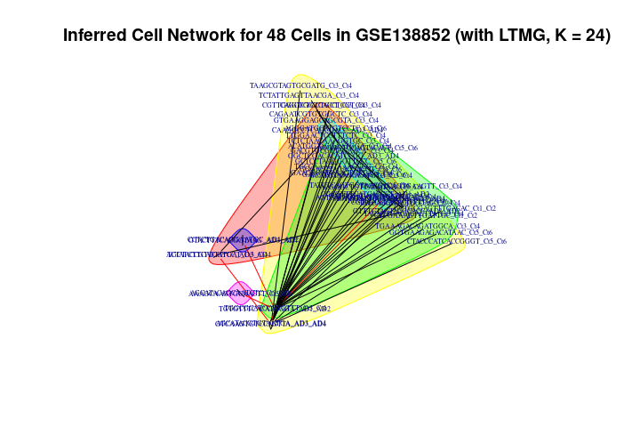
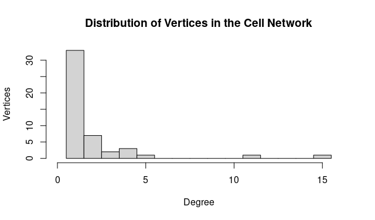
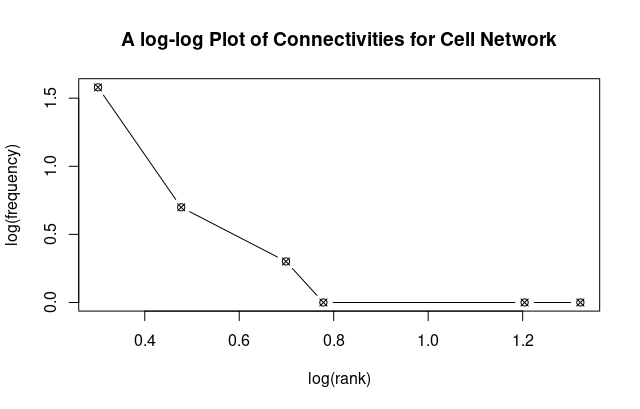
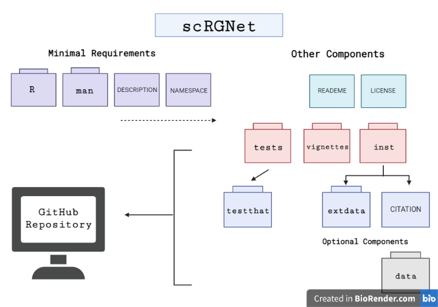

<!-- README.md is generated from README.Rmd. Please edit that file -->

```{r, include = FALSE}
knitr::opts_chunk$set(
  collapse = TRUE,
  comment = "#>",
  fig.path = "man/figures/README-",
  out.width = "100%"
)
```

# scRGNet

## Description
<!-- badges: start -->
<!-- badges: end -->

scRGNet is an R package for inferring cell-cell networks from scRNA-seq data.
It is the first R package that attempts to perform dimensional reduction using an feature(that is, gene) autoencoder from the novel single cell graph neural network (scGNN) framework.[@scGNN] It generate a feature matrix containing the low-dimensional representation of gene expression in each cell, and build a Cell-Cell network from the feature matrix using KNN. In training the feature autoencoder, discretized regulatory signals quantified from gene expression modeled by a left-truncated mixture Gaussian (LTMG) model can also be used as a regulariser.[@LTMG] It is unique from other R packages for scRNA-seq analysis in that scRGNet offers an option to analyse scRNA-seq data without assuming any statistical distribution or relationships for gene expression.

## Installation

To install the latest version of scRGNet:

``` r
require("devtools")
devtools::install_github("ff98li/scRGNet")
```

## Overview

```{r overview}
library(scRGNet)
ls("package:scRGNet")
data(package = "scRGNet")
```

Note that there are two datasets included in this package `gene_counts` and `gene_counts_small`. `gene_counts` is a raw scRNA-seq matrix from experiment GSE138852[@GSE138852]. `gene_counts_small` is a subset of the `gene_counts` data for a quick demo of the package, containing only 48 cells and 1000 genes. For usage of functions in the package, please refer to package vignettes for more details:

```{r, eval=FALSE}
browseVignettes(package = "scRGNet")
```

An example of a cell-cell network produced by this package using `plotNetwork()` follows:


The degree distribution of a network can be viewed through `plotDegree()`:



It also offers a quick way to plot log-rank against log frequency of degree in a network to further analyse the topological structure `plotLog()`:



An overview of the package is illustrated below.



## Contributions

The author of the package is Feifei Li. The *runLTMG* function uses the LTMG object and the function for inferring LTMG tags from `scgnnltmg`[@scGNN]. `data.table` R package[@dt] is used for fast reading in a large size scRNA-seq raw matrix from csv. The `Matrix`[@matrix] R package is used to store scRNA-seq data as a sparse matrix to reduce memory useage, and used to convert a tensor object to an R matrix. The *scDataset* object is an `R6` object[@r6] inherited from class `dataset` from `torch`. The feature autoencoder is also an R6 object inherited from the basic neural network modules `nn_module` from `torch` R package, and makes use of its functional modules `nnf_linear` and `nnf_relu`.[@torch] Iteration of model training makes use of `coro::loop` form the `coro` R package. The model training also uses `progress` R package to inform users the model trainning progress. The *generateNetwork* function makes use of `graph_from_data_frame` from `igraph` R package to generate a plottable `igraph` object.[@igraph] All plotting functions in this package make use of `graphics` R package. `cluster_label_prop` and `degree` function from `igraph` R package are used to compute the communities and degrees of the network.

## Acknowledgements

This  package  was  developed  as  part  of  an  assessment  for  2021  BCB410H:  Applied  Bioinfor-matics, University of Toronto, Toronto, CANADA.

## References
