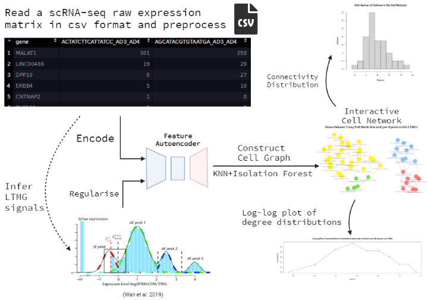

<!-- README.md is generated from README.Rmd. Please edit that file -->

```{r, include = FALSE}
knitr::opts_chunk$set(
  collapse = TRUE,
  comment = "#>",
  fig.path = "man/figures/README-",
  out.width = "100%"
)
```

# scRGNet

## Description
<!-- badges: start -->
<!-- badges: end -->

scRGNet is an R package for inferring cell-cell networks from encoded scRNA-seq data.
It is the first R package that attempts to use `torch`[@torch] in R to implement an feature(that is, gene) autoencoder from the recently proposed single cell graph neural network (scGNN) framework.[@scGNN] It generates an encoded feature matrix containing the low-dimensional representation of gene expression in each cell, and build a Cell-Cell network from the feature matrix using KNN and isolation forest[@isolationForest][@isotree]. When using the feature autoencoder, discretized regulatory signals quantified from gene expression modeled by a left-truncated mixture Gaussian (LTMG) model can also be used as a regulariser.[@LTMG] It is unique from other R packages for scRNA-seq analysis in that scRGNet offers an option to analyse scRNA-seq data without assuming statistical distributions or relationships for gene expression.

- R requirement: 4.1.2 or later version
- Development environment: Ubuntu 20.04 LTS
- Development platform: x86_64-pc-linux-gnu (64-bit)

## Installation

To install the latest version of scRGNet:

``` r
require("devtools")
devtools::install_github("ff98li/scRGNet", build_vignettes = TRUE)
```

To run the Shiny app:

``` r
scRGNet::runscRGNet()
```

A deployed demo is here: coming..

## Overview

```{r overview}
library(scRGNet)
ls("package:scRGNet")
data(package = "scRGNet")
```

Note that there are two datasets included in this package `gene_counts` and `gene_counts_small`. `gene_counts` is a raw scRNA-seq matrix from experiment GSE138852[@GSE138852]. `gene_counts_small` is a subset of the `gene_counts` data for a quick demo of the package, containing only 48 cells and 1000 genes. For usage of functions in the package, please refer to package vignettes for more details:

```{r, eval=FALSE}
browseVignettes(package = "scRGNet")
```

An overview of the package structure is provided below:

{ width=75% }

An overview of the package workflow is illustrated below:



## Contributions

The author of the package is Feifei Li. The *runLTMG* function uses the LTMG object and the function for inferring LTMG tags from `scgnnltmg`[@scGNN]. `data.table` R package[@dt] is used for fast reading in a large size scRNA-seq raw matrix from csv. The `Matrix`[@matrix] R package is used to store scRNA-seq data as a sparse matrix to reduce memory usage, and used to convert a tensor object to an R matrix. The *scDataset* object is an `R6` object[@r6] inherited from class `dataset` from `torch`. The feature autoencoder is also an R6 object inherited from the basic neural network modules `nn_module` from `torch` R package, and it makes use of its functional modules `nnf_linear` and `nnf_relu`.[@torch] Iteration of model training makes use of `coro::loop` form the `coro` R package. The model training also uses `progress` R package to inform users the model trainning progress. The *generateNetwork* function makes use of `graph_from_data_frame` from `igraph` R package to generate a plottable `igraph` object.[@igraph], and the isolation forest model from the `isotree` R package[@isotree] is used to prune outliers in cell graphs produced by *generateNetwork*. The interactive visualisation of produced cell network makes use of the `visNetwork` R package[@visNetwork]. `plotDegree` and `plotLog` make use of the `graphics` R package[@graphics]. `cluster_label_prop` and `degree` function from `igraph` R package are used to compute the communities and degrees of the network. The shiny app of this package is made with `shiny`[@shiny], `shinyjs`[@shinyjs], and `shinybusy`[@shinybusy] R packages. Except for the LTMG modeling in `runLTMG` uses external R package for computation, all other functions for data processing and analysis in this package are my original R implementation. 

## Acknowledgements

This  package  was  developed  as  part  of  an  assessment  for  2021  BCB410H:  Applied  Bioinformatics, University of Toronto, Toronto, CANADA.

## References
