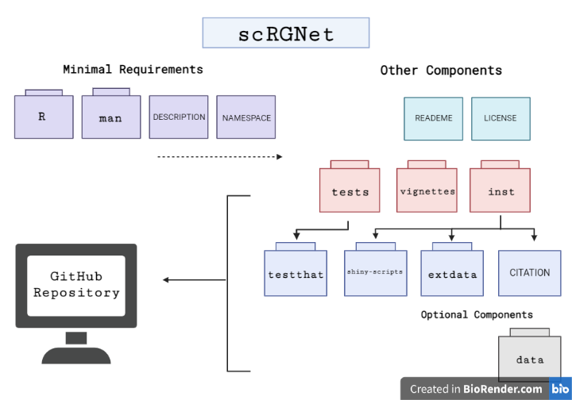

<!-- README.md is generated from README.Rmd. Please edit that file -->

# scRGNet

## Description

<!-- badges: start -->
<!-- badges: end -->

scRGNet is an R package for inferring cell-cell networks from encoded
scRNA-seq data. It is the first R package that attempts to use
`torch`([Falbel et al. 2021](#ref-torch)) in R to implement an
feature(that is, gene) autoencoder from the recently proposed single
cell graph neural network (scGNN) framework.([Wang et al.
2021](#ref-scGNN)) It generates an encoded feature matrix containing the
low-dimensional representation of gene expression in each cell, and
build a Cell-Cell network from the feature matrix using KNN and
isolation forest([Liu, Ting, and Zhou
2008](#ref-isolationForest))([Cortes 2021](#ref-isotree)). When using
the feature autoencoder, discretized regulatory signals quantified from
gene expression modeled by a left-truncated mixture Gaussian (LTMG)
model can also be used as a regulariser.([Wan et al. 2019](#ref-LTMG))
It is unique from other R packages for scRNA-seq analysis in that
scRGNet offers an option to analyse scRNA-seq data without assuming
statistical distributions or relationships for gene expression.

-   R requirement: 4.1.2 or later version
-   Development environment: Ubuntu 20.04 LTS
-   Development platform: x86_64-pc-linux-gnu (64-bit)

## Installation

To install the latest version of scRGNet:

``` r
require("devtools")
devtools::install_github("ff98li/scRGNet", build_vignettes = TRUE)
```

To run the Shiny app:

``` r
scRGNet::runscRGNet()
```

A deployed demo is here: coming..

## Overview

``` r
library(scRGNet)
ls("package:scRGNet")
#>  [1] "gene_counts"       "gene_counts_small" "generateNetwork"  
#>  [4] "plotCellNet"       "plotDegree"        "plotLog"          
#>  [7] "preprocessCSV"     "runFeatureAE"      "runLTMG"          
#> [10] "runscRGNet"        "scDataset"         "setHardware"      
#> [13] "setHyperParams"
data(package = "scRGNet")
```

Note that there are two datasets included in this package `gene_counts`
and `gene_counts_small`. `gene_counts` is a raw scRNA-seq matrix from
experiment GSE138852([Grubman et al. 2019](#ref-GSE138852)).
`gene_counts_small` is a subset of the `gene_counts` data for a quick
demo of the package, containing only 48 cells and 1000 genes. For usage
of functions in the package, please refer to package vignettes for more
details:

``` r
browseVignettes(package = "scRGNet")
```

An overview of the package structure is provided below:



An overview of the package workflow is illustrated below:


## Contributions

The author of the package is Feifei Li. The *runLTMG* function uses the
LTMG object and the function for inferring LTMG tags from
`scgnnltmg`([Wang et al. 2021](#ref-scGNN)). `data.table` R
package([Dowle and Srinivasan 2021](#ref-dt)) is used for fast reading
in a large size scRNA-seq raw matrix from csv. The `Matrix`([Bates and
Maechler 2021](#ref-matrix)) R package is used to store scRNA-seq data
as a sparse matrix to reduce memory usage, and used to convert a tensor
object to an R matrix. The *scDataset* object is an `R6` object([Chang
2021](#ref-r6)) inherited from class `dataset` from `torch`. The feature
autoencoder is also an R6 object inherited from the basic neural network
modules `nn_module` from `torch` R package, and it makes use of its
functional modules `nnf_linear` and `nnf_relu`.([Falbel et al.
2021](#ref-torch)) Iteration of model training makes use of `coro::loop`
form the `coro` R package. The model training also uses `progress` R
package to inform users the model trainning progress. The
*generateNetwork* function makes use of `graph_from_data_frame` from
`igraph` R package to generate a plottable `igraph` object.([Csardi and
Nepusz 2006](#ref-igraph)), and the isolation forest model from the
`isotree` R package([Cortes 2021](#ref-isotree)) is used to prune
outliers in cell graphs produced by *generateNetwork*. The interactive
visualisation of produced cell network makes use of the `visNetwork` R
package([Almende B.V. and Contributors, Thieurmel, and Robert
2021](#ref-visNetwork)). `plotDegree` and `plotLog` make use of the
`graphics` R package([R Core Team 2021](#ref-graphics)).
`cluster_label_prop` and `degree` function from `igraph` R package are
used to compute the communities and degrees of the network. The shiny
app of this package is made with `shiny`([Chang et al.
2021](#ref-shiny)), `shinyjs`([Attali 2020](#ref-shinyjs)), and
`shinybusy`([Meyer and Perrier 2020](#ref-shinybusy)) R packages. Except
for the LTMG modeling in `runLTMG` uses external R package for
computation, all other functions for data processing and analysis in
this package are my original R implementation.

## Acknowledgements

This package was developed as part of an assessment for 2021 BCB410H:
Applied Bioinformatics, University of Toronto, Toronto, CANADA.

## References

<div id="refs" class="references csl-bib-body hanging-indent">

<div id="ref-visNetwork" class="csl-entry">

Almende B.V. and Contributors, Benoit Thieurmel, and Titouan Robert.
2021. *visNetwork: Network Visualization Using ’Vis.js’ Library*.
<https://CRAN.R-project.org/package=visNetwork>.

</div>

<div id="ref-shinyjs" class="csl-entry">

Attali, Dean. 2020. *Shinyjs: Easily Improve the User Experience of Your
Shiny Apps in Seconds*. <https://CRAN.R-project.org/package=shinyjs>.

</div>

<div id="ref-matrix" class="csl-entry">

Bates, Douglas, and Martin Maechler. 2021. *Matrix: Sparse and Dense
Matrix Classes and Methods*.
<https://CRAN.R-project.org/package=Matrix>.

</div>

<div id="ref-r6" class="csl-entry">

Chang, Winston. 2021. *R6: Encapsulated Classes with Reference
Semantics*. <https://CRAN.R-project.org/package=R6>.

</div>

<div id="ref-shiny" class="csl-entry">

Chang, Winston, Joe Cheng, JJ Allaire, Carson Sievert, Barret Schloerke,
Yihui Xie, Jeff Allen, Jonathan McPherson, Alan Dipert, and Barbara
Borges. 2021. *Shiny: Web Application Framework for r*.
<https://CRAN.R-project.org/package=shiny>.

</div>

<div id="ref-isotree" class="csl-entry">

Cortes, David. 2021. *Isotree: Isolation-Based Outlier Detection*.
<https://CRAN.R-project.org/package=isotree>.

</div>

<div id="ref-igraph" class="csl-entry">

Csardi, Gabor, and Tamas Nepusz. 2006. “The Igraph Software Package for
Complex Network Research.” *InterJournal* Complex Systems: 1695.
<https://igraph.org>.

</div>

<div id="ref-dt" class="csl-entry">

Dowle, Matt, and Arun Srinivasan. 2021. *Data.table: Extension of
‘Data.frame‘*. <https://CRAN.R-project.org/package=data.table>.

</div>

<div id="ref-torch" class="csl-entry">

Falbel, Daniel, Javier Luraschi, Dmitriy Selivanov, Athos Damiani,
Christophe Regouby, Krzysztof Joachimiak, and Hamada S. Badr. 2021.
“Torch: Tensors and Neural Networks with ’GPU’ Acceleration.” RStudio.
<https://torch.mlverse.org/>.

</div>

<div id="ref-GSE138852" class="csl-entry">

Grubman, Alexandra, Gabriel Chew, John F Ouyang, Guizhi Sun, Xin Yi
Choo, Catriona McLean, Rebecca K Simmons, et al. 2019. “A Single-Cell
Atlas of Entorhinal Cortex from Individuals with Alzheimer’s Disease
Reveals Cell-Type-Specific Gene Expression Regulation.” *Nature
Neuroscience* 22 (12): 2087–97.

</div>

<div id="ref-isolationForest" class="csl-entry">

Liu, Fei Tony, Kai Ming Ting, and Zhi-Hua Zhou. 2008. “Isolation
Forest.” In *2008 Eighth IEEE International Conference on Data Mining*,
413–22. <https://doi.org/10.1109/ICDM.2008.17>.

</div>

<div id="ref-shinybusy" class="csl-entry">

Meyer, Fanny, and Victor Perrier. 2020. *Shinybusy: Busy Indicator for
’Shiny’ Applications*. <https://CRAN.R-project.org/package=shinybusy>.

</div>

<div id="ref-graphics" class="csl-entry">

R Core Team. 2021. *R: A Language and Environment for Statistical
Computing*. Vienna, Austria: R Foundation for Statistical Computing.
<https://www.R-project.org/>.

</div>

<div id="ref-LTMG" class="csl-entry">

Wan, Changlin, Wennan Chang, Yu Zhang, Fenil Shah, Xiaoyu Lu, Yong Zang,
Anru Zhang, et al. 2019. “<span class="nocase">LTMG: a novel statistical
modeling of transcriptional expression states in single-cell RNA-Seq
data</span>.” *Nucleic Acids Research* 47 (18): e111–11.
<https://doi.org/10.1093/nar/gkz655>.

</div>

<div id="ref-scGNN" class="csl-entry">

Wang, Juexin, Anjun Ma, Yuzhou Chang, Jianting Gong, Yuexu Jiang,
Hongjun Fu, Cankun Wang, Ren Qi, Qin Ma, and Dong Xu. 2021. “scGNN Is a
Novel Graph Neural Network Framework for Single-Cell RNA-Seq Analyses.”
*Nature Communications*. <https://doi.org/10.1038/s41467-021-22197-x>.

</div>

</div>
