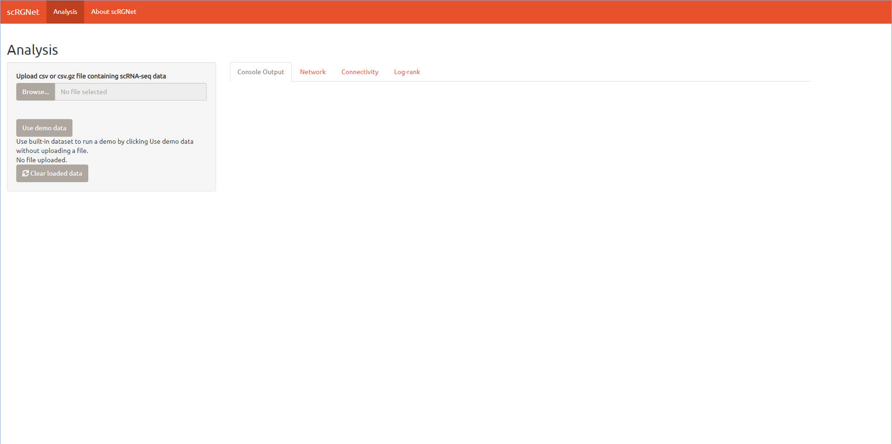
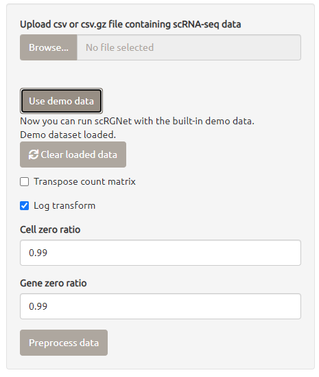
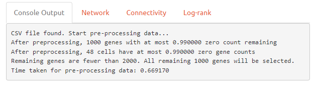
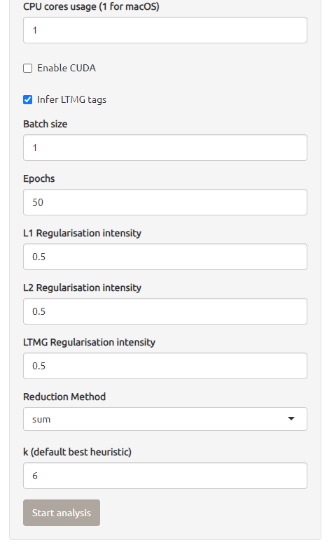
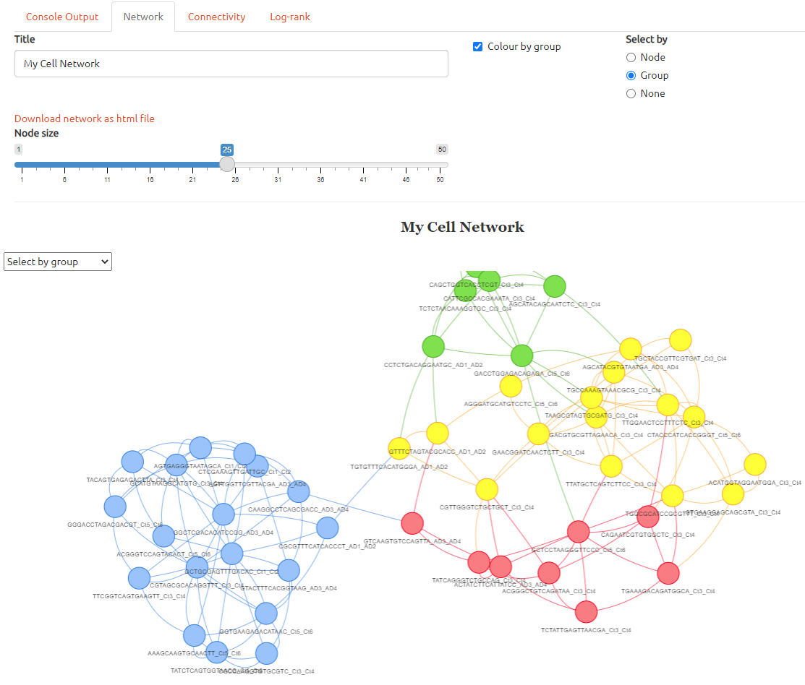
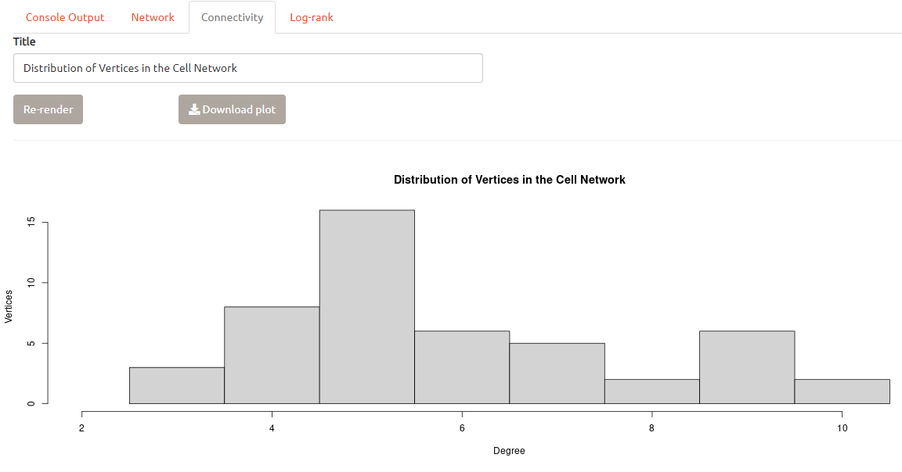
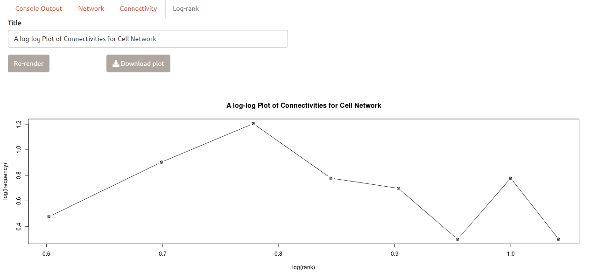

```{r, include = FALSE}
knitr::opts_chunk$set(
  collapse = TRUE,
  comment = "#>"
)
```

```{r setup}
library(scRGNet)
```

## Initial User Interface

First, to use the scRGNet shiny app, run the following line in R console:

```{r, eval=FALSE}
scRGNet::runscRGNet()
```

And a window will pop up with the following interface:

{width=800px}

The initial user interface consists of two main parts:
the sidebar panel and the main panel.
The sidebar panel is where options are provided to perform analysis,
and the main panel is where the results of analysis will be displayed.
Note that for now we don't see many options available in the sidebar panel.
This is because we haven't uploaded any data to the application.
If the current stage does not have enough reasonable data for the next stage analysis,
then options for the next stage in the sidebar panel will not appear.
Here we will continue using the demo dataset to walk through this application.
To load the demo dataset that comes with the scRGNet package, click **Use demo data**.

# Preprocess Data

As the demo dataset has been loaded,
options for preprocessing the loaded data are now available in the sidebar panel:

{width=400px}

Two options and two fields are now available for user:

- **Transpose count matrix**: If the raw gene matrix uploaded is provided with genes as columns and cells as rows, please check this option.
- **Log transform**: Perform log-transform on the loaded data
- **Cell zero ratio**: the maximum proportion of genes with zeros in cells; this filters out cells with more than this ratio of genes that are zeros
- **Gene zero ratio**: Filters genes with more than this ratio of zero values

If you would like to upload a new gene count file, you may click the **Clear loaded data** to remove the previously uploaded file.

Here we proceed with the default values and options.

Click the **Preprocess data** to move on.

## Console Output

As the data preprocessing is completed, you will see new messages
in the panel under the **Console Output** tab.
It shows detailed information regarding the result of preprocessing.

{width=600px}

# Prepare for Running Aanalysis

After preprocessing the data, more options become available to the user:

{width=300px}

The first two options are for setting hardware for running the analysis,
as scRGNet requires moderate amount of computational resource.

## Hardware Setup

- **CPU cores usage**: how many CPU cores to be used to run analysis. Note for macOS user, this option must remain 1.
- **Enable CUDA**: If you have a powerful Nvidia graphics card and would like to use it to train the model, you might consider check this option. However, only CUDA 10 and 11.1 are supported, and make sure you have the correct CUDA version installed in your computer. If you are not sure, keep this option unchecked.

Note that if scRGNet is being run on a server, these hardware options will not be displayed, as they should be configured according to the hardware specification of the server it is running on.

## Hyperparameters

Hyperparameters are related to how well the modal will perform the analysis result. They will require some tuning with several runs. And this is where you can make use of the messages from the Console Output.

- **Infer LTMG tags**: Whether to use discretized regulatory signals quantified from gene expression modeled by a left-truncated mixture Gaussian (LTMG) model as a regulariser.
- **Batch size**: the input batch size running the modal
- **Epochs**: number of epochs to train
- **L1**: the intensity of L1 regularizer
- **L2**: the intensity of L2 regularizer
- **Regu alpha**: intensity of LTMG regularisation
- **Reduction**: Type of reduction method to use
- **k**: Number of nearest cell neighbours in fitting KNN. The default is the best heuristic calculated from the preprocessed data.

Click **Start analysis** to run analysis on the data. The time it takes to wait depending on the size of data.

# Graphical Output

After the application finishes encoding the gene expression value,
an interactive cell network will be available under the **Network** tab:

Note that if you would like to export the network as an image,
it is recommended to use **Download network as html file** to download the network as an html file first, and then export the image in the downloaded html file.
The image resolution will be better than directly exporting in the app.

{width=400px}

The **connectivity** tab shows the distribution of connectivuty in the cell network:

{width=500px}

And the **Log-rank** tab shows the log-log plot of degree distributions for the generated cell network.

{width=500px}

# Acknowledgements

This app is built using `shiny`[@shiny], `shinyjs`[@shinyjs], and `shinybusy`[@shinybusy] R packages.

# References
